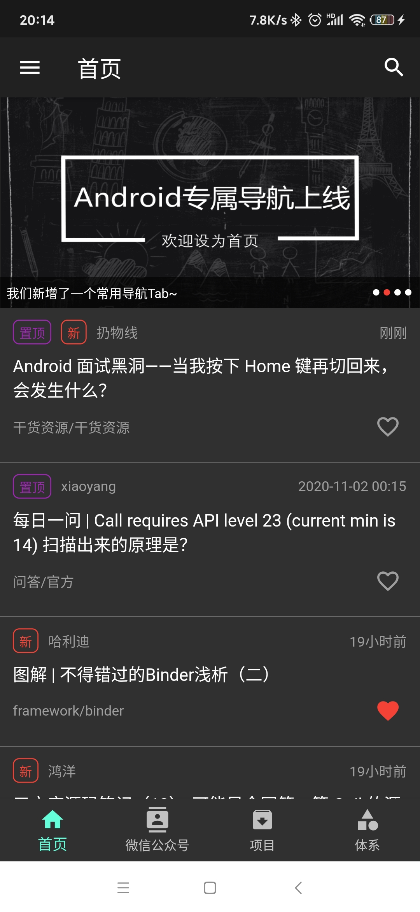
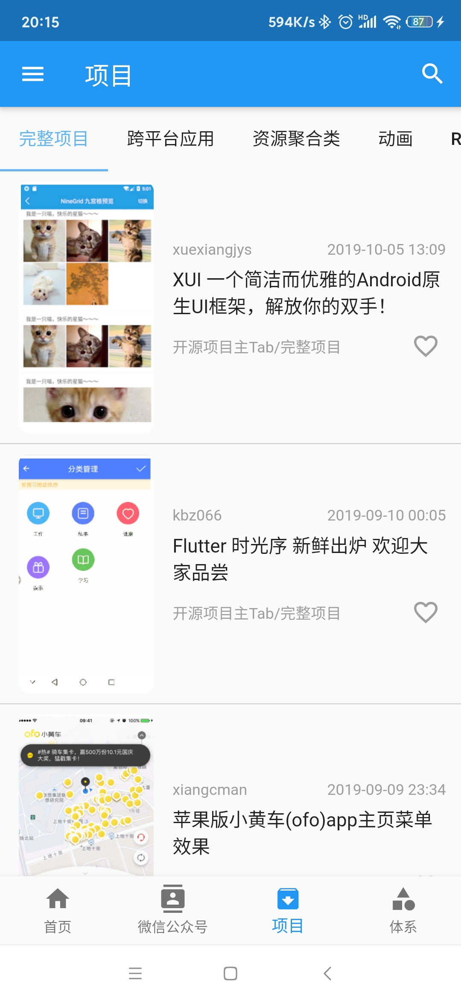
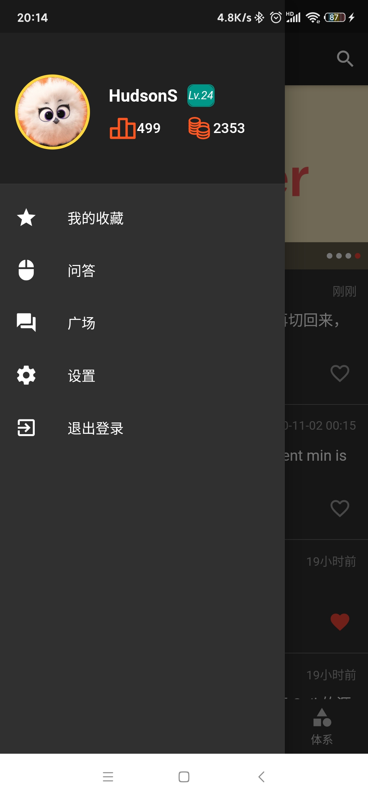
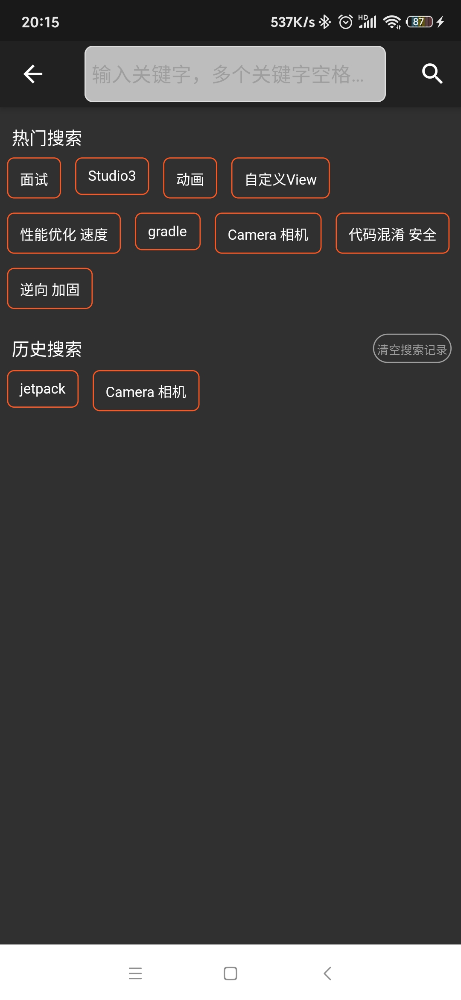
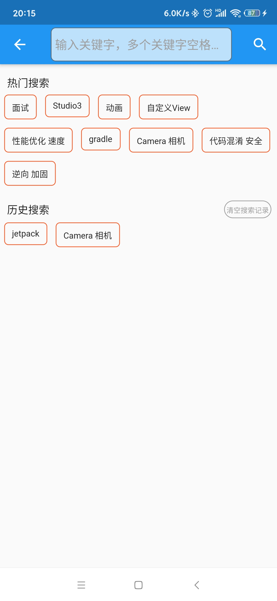

# wanandroid_flutter

wanandroid flutter版本，android版APK包[下载地址](/android/app/release/app-release.apk)

## UI展示
  
  

## 包结构说明
项目代码整体包结构以视图层和数据层区分开。

视图层(ui包)中包括了所有的与界面元素相关的代码或Widget，其中article包是文章列表的一项视图；banner是滚动轮播的视图；
common包含了公用视图；drawer是侧边栏视图；page是所有各个页面的视图包。

数据层(data包)中包括了：

- entity包： 所有网络数据实体对应的实际类的包
- repository包： 所有网络请求相关的接口和数据处理都在这个包中

处理上面视图层和数据层外，还有其他包。 其中common中包括了状态管理包(state包)和其他一些通用的代码逻辑；generated包和
l10n包是由国际化插件[Flutter Intl](https://plugins.jetbrains.com/plugin/13666-flutter-intl)自动生成的包，一般
情况下不需要修改它们。

## 实践内容

## [Banner实践](/lib/ui/banner)

## 嵌套滚动型Widget处理方案（首页）
利用Slivers完成，相关信息见[medium的这篇文章](https://medium.com/flutter/slivers-demystified-6ff68ab0296f)

## 国际化
国际化使用了[Flutter Intl](https://plugins.jetbrains.com/plugin/13666-flutter-intl) 插件，详情见插件介绍和使用方法。

注意：

   包结构中，generated是国际化插件生成的文件，不要修改；

   我们需要增加国际化字段的地方在/lib/l10n中；

   增加新语言和其他操作，见插件介绍。

备注：该插件有个快捷键，光标放在要国际化的字符串上，Alt+回车，选择Extract to ARB file，命名确认后，将帮助我们自动增加国际化字段。

## 性能优化
在Flutter中由于存在大量的嵌套，导致代码可阅读性大大降低，同时增加代码混乱度。为此，我们经常想到的办法是将部分代码抽取出来
作为一个方法或者函数，亦或者抽取成一个单独的类。然而在Flutter中，如果在StatefulWidget中把代码抽取成一个单独的方法，有可能
造成不必要的重复构建，具体原因见[这篇文章](https://iiro.dev/2018/12/11/splitting-widgets-to-methods-performance-antipattern/),
为此，我们需要把有状态的小部件中固定的代码抽取成一个StatelessWidget，并借助[const](https://stackoverflow.com/questions/21744677/how-does-the-const-constructor-actually-work)的构造方法（函数）以避免重复构建。

## 刷新和加载更多组件
系统为我们提供了RefreshIndicator来提供下拉刷新的功能，但一般情况下，我们列表页面还需要支持上拉加载更多的选项，因此选择了SmartRefresher。
（备注：代码中保留了通过监听列表底部来触发加载更多的逻辑代码，见[HomePageDeprecated](/lib/ui/page/home_page_deprecated.dart) ）
SmartRefresher新版本比旧版本优化了很多，例如旧版本中加载的文本提示都是英文的，需要我们重新配置以支持国际化，新版本中已经完全包含了国际化的
处理（具体参考其内部源码的classic_indicator中逻辑包含有RefreshLocalizations）。不过，该库需要我们在APP根widget中配置语言信息，具体见
main.dart和该库的refresh_localizations.dart说明。
使用SmartRefresher后，列表加载到底部后，我们不再需要手动监听滑动到底部的事件了，直接使用SmartRefresher的onLoading来加载更多数据。
代码中的经典示例见[统一加载刷新页面](/lib/ui/common/page_wrapper.dart)和具体实现[HomePage](/lib/ui/page/home_page.dart)。

## 图片选择
请参考Medium上的[这篇文章](https://medium.com/fabcoding/adding-an-image-picker-in-a-flutter-app-pick-images-using-camera-and-gallery-photos-7f016365d856)
以及[官方地址](https://pub.dev/packages/image_picker)

## 异步加载状态的显示

问题产生的原因：

在像Android中，我们可以监听网络请求的状态，并给用户显示当前状态，且在失败的情况下给予重试方案，以给用户更好的体验。那么在Flutter中该如何监听
数据请求的状态？

解决方案：

使用FutureBuilder或StreamBuilder。前者针对仅监听一次即结束的数据请求，可以参考[这篇文章](https://medium.com/flutterpub/network-call-with-progress-error-retry-in-flutter-8b58585f0b26);
后者针对需要使用[Stream](https://juejin.im/post/6844903686737494023)的情况下的对应监听方案，例如我们监听位置变化时，我们需要持续获取位置信息，而不是一次性就结束。
两者更多的区别见[StackOverFlow这里的解释](https://stackoverflow.com/questions/50844519/flutter-streambuilder-vs-futurebuilder)。

随之产生的问题：

从FutureBuilder的[使用](https://medium.com/flutterpub/network-call-with-progress-error-retry-in-flutter-8b58585f0b26)可以看出future属性仅能接受一个
异步方法，如果一个Widget存在多个请求该如何处理？

解决方案：

见[这里](https://stackoverflow.com/questions/50626949/can-i-use-multiple-method-on-a-future-builder)。
在[首页](/lib/ui/page/home_page.dart)也是通过这种方式实现的。

## 状态管理-Provider
用户收藏的文章列表需要在各个列表页面都有影响（是否标记为红心文章），因此需要提供一个全局的状态信息管理者（注意：并不是所有的状态都适合作为全局存在），
这里状态管理使用官方推荐的[Provider](https://pub.dev/packages/provider)。

Provider可以说是InheritedWidget的一种升级，是保证简洁化向子Widget传递且能够更好管理的状态管理方案。关于它的使用和好处，请参考下面文章：

[Flutter使用的简单示例](https://medium.com/flutterdevs/managing-the-state-of-a-widget-using-provider-flutter-6b5090f18875)

[Flutter中的全局访问和范围访问](https://medium.com/coding-with-flutter/flutter-global-access-vs-scoped-access-with-provider-8d6b94393bdf)

[官方文档相关介绍](https://flutter.dev/docs/development/data-and-backend/state-mgmt/simple)

[Flutter状态管理指南-Provider](https://juejin.im/post/6844903864852807694)。

值得注意的是，Provider虽然可以全局管理状态，但是使用上面需要注意，我们不能在用户操作回调中调用获取Provider实例，否则将会报如下错误：

    Tried to listen to a value exposed with provider, from outside of the widget tree.

例如：

    IconButton(
        icon: Icon(Icons.favorite),
        onPressed: () {
          // error here
          if(Provider.of<AccountProvider>(context).isLogin()){
            setState(() {
              isStared = !isStared;
            });
          }else{
            // not login
          }
        },
      )

更多请参考[StackOverflow上这个回答](https://stackoverflow.com/questions/59898274/flutter-provider-access-via-addpostframecallback-says-widget-is-outside-the-widg)

## 后续可优化或增加的功能
目前整套APP的结构采用SharedPreferences作为缓存，缓存了包括用户登录信息、用户头像信息等，这些数据体积相对来说较为庞大，并不是十分适合SharedPreferences，
因此可以考虑后续优化使用[Sqflite](https://pub.dev/packages/sqflite)替换原有方案。

另外，目前整套APP中没有对网络数据进行缓存，因此在没有任何网络的情况下，大部分页面都将会是加载失败状态，后续可以针对[Repository](/lib/data/repository/wan_repository.dart)
进行升级，增加数据库缓存的逻辑，具体的实现方案可以与[Android kotlin jetpack版本WanAndroid](https://github.com/HudsonAndroid/WanAndroidJetpack)的数据缓存方案类似。

## 其他问题
#### 项目报错，提示网络错误
项目跑起来报错，提示网络问题，类似如下报错：

    Exception in thread "main" java.net.ConnectException: Connection timed out (Connection timed out)

这种情况下，我们最好通过命令行的方式并带日志运行，以查看全面的日志信息，执行 flutter run -v 命令。我实际开发过程中
遇到的错误是提示gradle下载失败（这点不得不吐槽下，通过普通run的方式根本看不出来是什么导致的错误，普通run的错误日志毫无意义）。
这种情况下（gradle下载失败），可以尝试以下方法：

手动下载（[下载地址](https://gradle.org/releases/)），然后把android module中的gradle文件夹下gradle-wrapper.properties
的distributionUrl替换成我们下载下来的zip包的路径，例如下面我下载在e盘目录下，修改为对应地址。

     distributionBase=GRADLE_USER_HOME
     distributionPath=wrapper/dists
     zipStoreBase=GRADLE_USER_HOME
     zipStorePath=wrapper/dists
     distributionUrl=file\:///E:/ProgramFile/androidstudio/gradle/gradle-5.6.4-all.zip

重新运行，flutter命令行会自动帮我们解压结果（注意我们手动解压不行，因为有hash值，所以让flutter帮我们解压，它会解压在c盘
的对应user的.gradle目录下，由哈希值命名的文件夹内部就是了），这样我们才能正常运行起来。

## 附：
大部分情况下，有状态的Widget基本上是固定的样式，因此最好通过Android Studio的Live Templates配置以便省略固定代码格式。
(File -> Settings -> 搜索Live Templates -> 找到Dart -> 点击右侧增加Live Templates -> 在出现的编辑框的下方输入
名字[后面快速编码的缩写名，类似android中的fv生成findViewById快捷方式],在下方定义选择dart，并输入如下代码，这样下次
编写类似固定格式时即可省略不必要的编写过程)。

    import 'package:flutter/material.dart';

    class $CLASS$ extends StatefulWidget {

        @override
        _$CLASS$State createState() => _$CLASS$State();

    }

    class _$CLASS$State extends State<$CLASS$> {

        @override
        Widget build(BuildContext context) {
            //  TODO: implement build
            throw UnimplementedError();
        }
    }

## Getting Started

This project is a starting point for a Flutter application.

A few resources to get you started if this is your first Flutter project:

- [Lab: Write your first Flutter app](https://flutter.dev/docs/get-started/codelab)
- [Cookbook: Useful Flutter samples](https://flutter.dev/docs/cookbook)

For help getting started with Flutter, view our
[online documentation](https://flutter.dev/docs), which offers tutorials,
samples, guidance on mobile development, and a full API reference.
